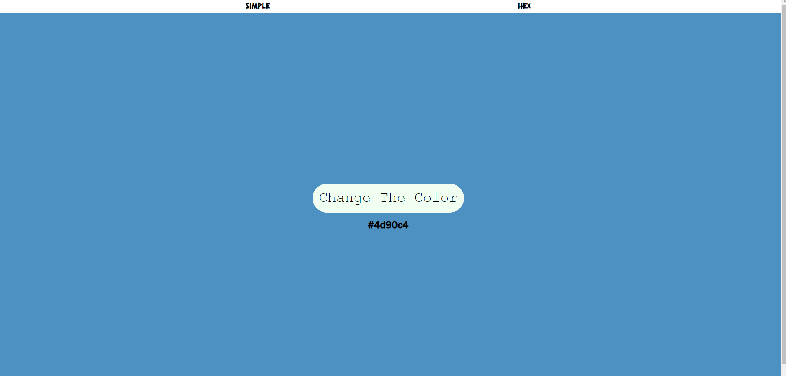

# Change-color-app-js-css

A simple color change generator

#### JavaScript Used

* DOM Manipulation
* JavaScript CSS Manipulation
* Css Animations
* addEventListener

### Built With
* [Javascipt](https://www.javascript.com/)
* [HTML](https://html.com/)
* [CSS](https://css.com/)

<!-- CONTACT -->
## Contact

Furkan Çat - [@FurkanCat](https://twitter.com/FurkanCat) - furi544@gmail.com

Project Link: [Project Link](https://github.com/InsomniumFerum/change-color-app-js-css)
